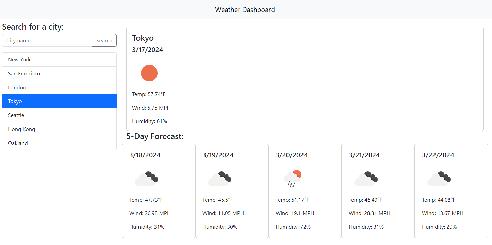

# weather-dashboard

## Description
This is a weather dashboard that allows the user to search for a city and see the current weather and a 5-day forecast. The user's search history is saved and can be clicked on to see the weather for that city again.

## Features
- Search for a city
- View the current weather
- View a 5-day forecast
- Click on a city in the search history to see the weather for that city again

## Technologies
- HTML
- CSS
- JavaScript
- OpenWeatherMap API

## Screenshot

## Deployed Application 
The project is deployed at the following URL: [Weather Dashboard](https://aaronh-o.github.io/weather-dashboard/)